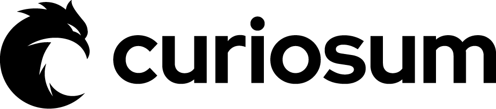
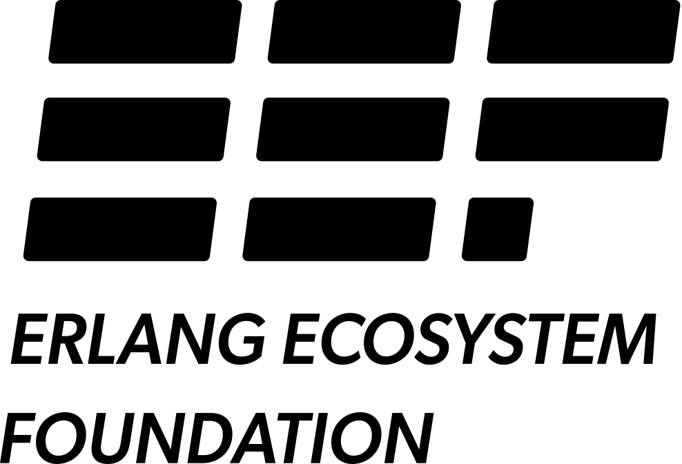

# Hologram

Build rich, interactive UIs entirely in Elixir using Hologram's declarative component system. Your client-side code is intelligently transpiled to JavaScript, providing modern frontend capabilities without relying on any JavaScript frameworks.

Website: https://hologram.page

## Sponsors

### Main Sponsor

<a href="https://www.curiosum.com" target="_blank">
  <picture>
    <source media="(prefers-color-scheme: dark)" srcset=".sponsors/curiosum_logo_horizontal_mono_white.png">
    <source media="(prefers-color-scheme: light)" srcset=".sponsors/curiosum_logo_horizontal_mono_black.png">
    
  </picture>
</a>

[Curiosum](https://www.curiosum.com)

### Milestones Sponsor

<a href="https://erlef.org" target="_blank">
  <picture>
    <source media="(prefers-color-scheme: dark)" srcset=".sponsors/eef_logo_vertical_white.png">
    <source media="(prefers-color-scheme: light)" srcset=".sponsors/eef_logo_vertical_black.png">
    
  </picture>
</a>

[Erlang Ecosystem Foundation](https://erlef.org)

### Innovation Partner Tier

* Sheharyar Naseer, [@sheharyarn](https://github.com/sheharyarn)

### Framework Visionary Tier

* [@absowoot](https://github.com/absowoot)
* Uzair Aslam, [@uzairaslam196](https://github.com/uzairaslam196)
* Oban, [@oban-bg](https://github.com/oban-bg)
* Lucas Sifoni, [@Lucassifoni](https://github.com/Lucassifoni)
* Robert Urbańczyk, [@robertu](https://github.com/robertu)

### Early Adopter Tier

* Daniel Calancea, [@D4no0](https://github.com/D4no0)
* Darren Black, [@totaltrash](https://github.com/totaltrash)
* [@jzimmek](https://github.com/jzimmek)
* Nicholas Moen, [@arcanemachine](https://github.com/arcanemachine)
* [@pasila](https://github.com/pasila)
* Jonatan Männchen, [@maennchen](https://github.com/maennchen)
* Douglas Manzelmann, [@douglasmanzelmann](https://github.com/douglasmanzelmann)
* James Harton, [@jimsynz](https://github.com/jimsynz)
* Ian Asaff, [@montague](https://github.com/montague)
* Juozas Norkus, [@jozuas](https://github.com/jozuas)
* Thomas, [@thomaswhyyou](https://github.com/thomaswhyyou)
* Max, [@Makesesama](https://github.com/Makesesama)

Thank you to **all other** sponsors for supporting the project!

If you find Hologram useful and would like to support its development, consider becoming a sponsor! Your contributions help improve the project and keep it alive.

[Become a Sponsor](https://github.com/sponsors/bartblast)

Thank you for your support!