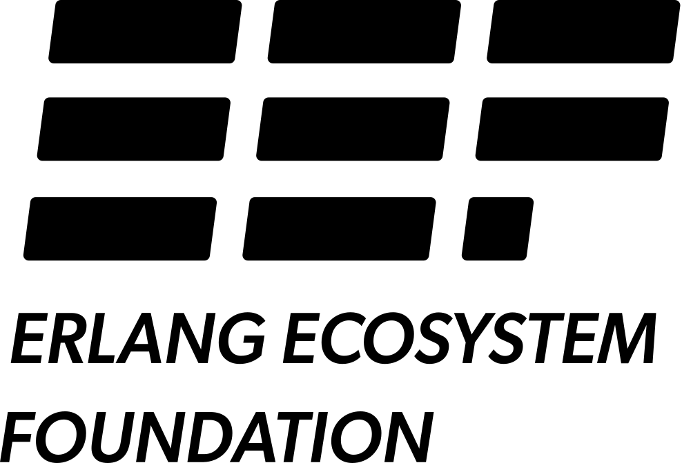

# Hologram

Build rich, interactive UIs entirely in Elixir using Hologram's declarative component system. Your client-side code is intelligently compiled to JavaScript, providing modern frontend capabilities without relying on any JavaScript frameworks.

Website: https://hologram.page

## Community

- Elixir Forum: https://elixirforum.com/hologram
- Discord: https://discord.gg/huJWNuqt8J
- Slack: https://elixir-lang.slack.com/channels/hologram

## Build in Public

- LinkedIn: https://www.linkedin.com/in/bartblast/
- X: https://x.com/Bart_Blast
- Bluesky: https://bsky.app/profile/bartblast.com

## Sponsors

### Main Sponsor

<a href="https://www.curiosum.com/?utm_source=github.com&utm_medium=sponsor-logo&utm_campaign=sponsoring_hologram" target="_blank">
  <picture>
    <source media="(prefers-color-scheme: dark)" srcset=".sponsors/curiosum_logo_horizontal_mono_white.png">
    <source media="(prefers-color-scheme: light)" srcset=".sponsors/curiosum_logo_horizontal_mono_black.png">
    
  </picture>
</a>

[Curiosum](https://www.curiosum.com/?utm_source=github.com&utm_medium=sponsor-logo&utm_campaign=sponsoring_hologram)

### Milestones Sponsor

<a href="https://erlef.org" target="_blank">
  <picture>
    <source media="(prefers-color-scheme: dark)" srcset=".sponsors/eef_logo_vertical_white.png">
    <source media="(prefers-color-scheme: light)" srcset=".sponsors/eef_logo_vertical_black.png">
    
  </picture>
</a>

[Erlang Ecosystem Foundation](https://erlef.org)

### Performance Sponsor

<a href="https://www.evostore.no/" target="_blank">
  <picture>
    <source media="(prefers-color-scheme: dark)" srcset=".sponsors/evo_store_logo_horizontal_white.svg">
    <source media="(prefers-color-scheme: light)" srcset=".sponsors/evo_store_logo_horizontal_black.svg">
    
  </picture>
</a>

[Evo Store](https://www.evostore.no/)

### Innovation Partner Tier

* Sheharyar Naseer, [@sheharyarn](https://github.com/sheharyarn)

### Framework Visionary Tier

* [@absowoot](https://github.com/absowoot)
* Robert Urbańczyk, [@robertu](https://github.com/robertu)
* Moss Piglet, [@moss-piglet](https://github.com/moss-piglet)

### Early Adopter Tier

* Daniel Calancea, [@D4no0](https://github.com/D4no0)
* [@pasila](https://github.com/pasila)
* Jonatan Männchen, [@maennchen](https://github.com/maennchen)
* James Harton, [@jimsynz](https://github.com/jimsynz)
* Ian Asaff, [@montague](https://github.com/montague)
* Max, [@Makesesama](https://github.com/Makesesama)

Thank you to **all other** sponsors for supporting the project!

If you find Hologram useful and would like to support its development, consider becoming a sponsor! Your contributions help improve the project and keep it alive.

[Become a Sponsor](https://github.com/sponsors/bartblast)

Thank you for your support!